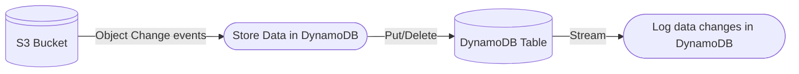

# TechFest CDK Workshop

This repo contains the code to follow along with the TechFest CDK Workshop

## Getting started

This repository is designed to be opened in VSCode and run within the included [devcontainer](.devcontainer/devcontainer.json).

When you open this repository in the Devcontainer, the following resources will be setup;

1. [Floci](https://floci.io/) will be installed. This is a local AWS emulator that allows you to follow along without spending any money on a real AWS account or services.
2. The `cdk:prepare` script will run, which launches Floci and wait for it to become available on http://localhost:4566.
3. Once available, the [`cdk bootstrap`](https://docs.aws.amazon.com/cdk/v2/guide/bootstrapping.html) command will be run, readying the environment for use with AWS CDK.

From this point, you can run `npm run cdk:deploy` to deploy the included CDK app to the emulated environment.

## Interacting with the application

The app is a simple serverless example:

You can trigger the Lambdas to run with the `npm run task:upload`. This will construct and upload a JSON file to the deployed S3 bucket. 
You can then view the logs with `npm run task:logs`. This will make API requests to AWS Cloudwatch to get the logs from the Lambdas. This is in place of a suitable alternative through the Floci UI.